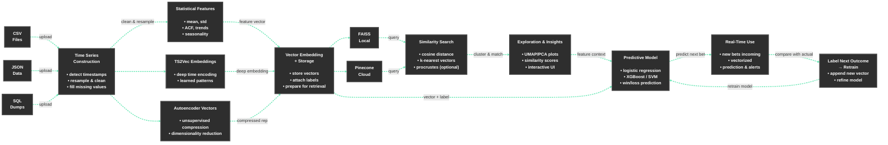

```mermaid
flowchart LR

    %% Raw Dataset boxes
    A1["CSV<br/>Files"]
    A2["JSON<br/>Data"] 
    A3["SQL<br/>Dumps"]

    %% Time Series Conversion
    B["Time Series<br/>Construction<br/><br/>• detect timestamps<br/>• resample & clean<br/>• fill missing values"]

    %% Feature Engineering boxes
    C1["Statistical Features<br/><br/>• mean, std<br/>• ACF, trends<br/>• seasonality"]
    C2["TS2Vec Embeddings<br/><br/>• deep time encoding<br/>• learned patterns"]
    C3["Autoencoder Vectors<br/><br/>• unsupervised compression<br/>• dimensionality reduction"]

    %% Vector Creation & Storage
    D["Vector Embedding<br/>+ Storage<br/><br/>• store vectors<br/>• attach labels<br/>• prepare for retrieval"]

    %% Storage options
    D1["FAISS<br/>Local"]
    D2["Pinecone<br/>Cloud"]

    %% Vector Alignment & Similarity
    E["Similarity Search<br/><br/>• cosine distance<br/>• k-nearest vectors<br/>• procrustes (optional)"]

    %% Visualization
    F["Exploration & Insights<br/><br/>• UMAP/PCA plots<br/>• similarity scores<br/>• interactive UI"]

    %% Supervised Model
    G["Predictive Model<br/><br/>• logistic regression<br/>• XGBoost / SVM<br/>• win/loss prediction"]

    %% Monitoring
    H["Real-Time Use<br/><br/>• new bets incoming<br/>• vectorized<br/>• prediction & alerts"]

    %% Feedback loop
    I["Label Next Outcome<br/>→ Retrain<br/>• append new vector<br/>• refine model"]

    %% Connections
    A1 -->|upload| B
    A2 -->|upload| B
    A3 -->|upload| B

    B -->|clean & resample| C1
    B --> C2
    B --> C3

    C1 -->|feature vector| D
    C2 -->|deep embedding| D
    C3 -->|compressed rep| D

    D --> D1
    D --> D2

    D1 -->|query| E
    D2 -->|query| E

    E -->|cluster & match| F
    F -->|feature context| G

    D -->|vector + label| G

    G -->|predict next bet| H
    H -->|compare with actual| I
    I -->|retrain model| G

    %% Styling
    classDef default fill:#2e2e2e,stroke:#4a4a4a,stroke-width:3px,color:#ffffff,font-weight:bold,font-size:16px,min-width:180px,min-height:100px
    classDef connector stroke:#6ee7b7,stroke-width:4px

    %% Style links
    linkStyle default stroke:#6ee7b7,stroke-width:3px,stroke-dasharray: 5 3
```