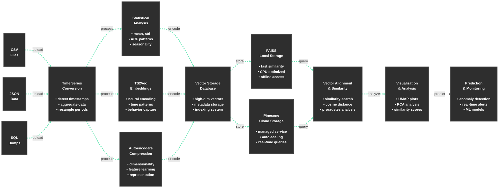

```mermaid
flowchart LR
    %% Raw Dataset boxes (stacked vertically)
    A1["<br/><br/>CSV<br/>Files<br/><br/>"]
    A2["<br/><br/>JSON<br/>Data<br/><br/>"] 
    A3["<br/><br/>SQL<br/>Dumps<br/><br/>"]
    
    %% Time Series Conversion
    B["<br/><br/>Time Series<br/>Conversion<br/><br/>• detect timestamps<br/>• aggregate data<br/>• resample periods<br/><br/>"]
    
    %% Feature Engineering boxes (stacked vertically)
    C1["<br/><br/>Statistical<br/>Analysis<br/><br/>• mean, std<br/>• ACF patterns<br/>• seasonality<br/><br/>"]
    C2["<br/><br/>TS2Vec<br/>Embeddings<br/><br/>• neural encoding<br/>• time patterns<br/>• behavior capture<br/><br/>"]
    C3["<br/><br/>Autoencoders<br/>Compression<br/><br/>• dimensionality<br/>• feature learning<br/>• representation<br/><br/>"]
    
    %% Vector Storage
    D["<br/><br/>Vector Storage<br/>Database<br/><br/>• high-dim vectors<br/>• metadata storage<br/>• indexing system<br/><br/>"]
    
    %% Storage options (under Vector Storage)
    D1["<br/><br/>FAISS<br/>Local Storage<br/><br/>• fast similarity<br/>• CPU optimized<br/>• offline access<br/><br/>"]
    D2["<br/><br/>Pinecone<br/>Cloud Storage<br/><br/>• managed service<br/>• auto-scaling<br/>• real-time queries<br/><br/>"]
    
    %% Vector Alignment
    E["<br/><br/>Vector Alignment<br/>& Similarity<br/><br/>• similarity search<br/>• cosine distance<br/>• procrustes analysis<br/><br/>"]
    
    %% Visualization
    F["<br/><br/>Visualization<br/>& Analysis<br/><br/>• UMAP plots<br/>• PCA analysis<br/>• similarity scores<br/><br/>"]
    
    %% Prediction
    G["<br/><br/>Prediction<br/>& Monitoring<br/><br/>• anomaly detection<br/>• real-time alerts<br/>• ML models<br/><br/>"]
    
    %% Connections with more spacing
    A1 -.->|upload| B
    A2 -.->|upload| B
    A3 -.->|upload| B
    
    B -.->|process| C1
    B -.->|process| C2
    B -.->|process| C3
    
    C1 -.->|encode| D
    C2 -.->|encode| D
    C3 -.->|encode| D
    
    D -.->|store| D1
    D -.->|store| D2
    
    D1 -.->|query| E
    D2 -.->|query| E
    E -.->|analyze| F
    F -.->|predict| G
    
    %% Larger, more readable styling
    classDef default fill:#2e2e2e,stroke:#4a4a4a,stroke-width:3px,color:#ffffff,font-weight:bold,font-size:16px,min-width:180px,min-height:120px
    classDef connector stroke:#6ee7b7,stroke-width:4px
    
    %% Style all links with labels
    linkStyle 0,1,2,3,4,5,6,7,8,9,10,11,12,13 stroke:#6ee7b7,stroke-width:4px,stroke-dasharray: 5 5
```