# Time Series Analysis & Vector Alignment Workflow

```mermaid
flowchart LR
    %% Raw Dataset boxes (stacked vertically)
    A1[📄 CSV]
    A2[📋 JSON] 
    A3[🗃️ SQL]
    
    %% Time Series Conversion
    B[🔄<br/>Time Series<br/>Conversion<br/>detect timestamps<br/>aggregate data]
    
    %% Feature Engineering boxes (stacked vertically)
    C1[📊 Statistical<br/>mean, std, ACF]
    C2[🤖 TS2Vec<br/>embeddings]
    C3[🧠 Autoencoders<br/>compression]
    
    %% Vector Storage
    D[💾<br/>Vector Storage<br/>high-dim vectors<br/>+ metadata]
    
    %% Storage options (under Vector Storage)
    D1[🔧 FAISS<br/>local]
    D2[☁️ Pinecone<br/>cloud]
    
    %% Vector Alignment
    E[🔍<br/>Vector Alignment<br/>similarity search<br/>cosine distance<br/>procrustes]
    
    %% Visualization
    F[📈<br/>Visualization<br/>UMAP plots<br/>PCA analysis<br/>similarity scores]
    
    %% Prediction
    G[🚀<br/>Prediction<br/>anomaly detection<br/>real-time alerts<br/>ML models]
    
    %% Connections
    A1 --> B
    A2 --> B
    A3 --> B
    
    B --> C1
    B --> C2
    B --> C3
    
    C1 --> D
    C2 --> D
    C3 --> D
    
    D --> D1
    D --> D2
    
    D1 --> E
    D2 --> E
    E --> F
    F --> G
    
    %% N8N Dark Theme Styling
    classDef default fill:#2e2e2e,stroke:#4a4a4a,stroke-width:2px,color:#ffffff,font-weight:bold,font-size:12px
    classDef connector stroke:#6ee7b7,stroke-width:3px
    
    %% Style all links
    linkStyle 0,1,2,3,4,5,6,7,8,9,10,11,12,13 stroke:#6ee7b7,stroke-width:3px
```

## Workflow Overview

This automated pipeline transforms raw time-series data into actionable insights through vector alignment and similarity analysis.

### Key Benefits
- **End-to-End Automation**: From upload to insights
- **Flexible Input**: Handles any time-component dataset  
- **Pattern Discovery**: Uncover hidden relationships
- **Real-time Monitoring**: Continuous analysis capabilities

### Technical Stack
- **Vector Databases**: FAISS, ChromaDB, Pinecone
- **ML Models**: TS2Vec, TST, autoencoders
- **Visualization**: UMAP, PCA, similarity matrices
- **Monitoring**: Anomaly detection, predictive alerts